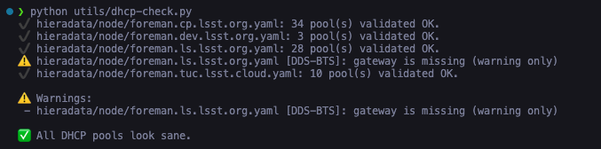
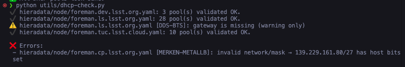

# DHCP Pool Checker

A validation tool for DHCP pools defined in Hiera YAML files (Foreman/Puppet configuration management). This tool prevents invalid subnet/mask configurations from causing failures in ISC DHCPD by validating network configurations prior to deployment.

## Overview

The `dhcp-check.py` script validates DHCP pool configurations in Puppet/Foreman Hiera YAML files to ensure:

- Valid network and mask combinations
- Correct gateway configurations (when present)
- Valid IP ranges within subnet boundaries
- No conflicts with network or broadcast addresses

## Features

- **Network Validation**: Ensures each `dhcp::pools` entry contains valid network and mask combinations
- **Gateway Validation**: Validates that gateway IP addresses are within the subnet and do not conflict with network or broadcast addresses
- **Range Validation**: Verifies that all IP ranges are within subnet boundaries and properly ordered
- **Configurable Warning System**: Provides configurable handling of missing gateway configurations
- **YAML Anchor Resolution**: Automatically resolves YAML files with duplicate anchor issues
- **CI/CD Integration**: Designed for automated validation within GitHub Actions workflows

## Installation & Usage

### Prerequisites

```bash
pip install pyyaml
```

### Basic Usage

```bash
# Validate all DHCP pools in the default directory (hieradata/node)
python utils/dhcp-check.py

# Specify custom directory
python utils/dhcp-check.py --dir hieradata/node

# Require gateways (treat missing gateway as an error)
python utils/dhcp-check.py --require-gateway

# Suppress gateway warnings
python utils/dhcp-check.py --no-warn-missing-gateway

# Strict mode (treat all warnings as errors)
python utils/dhcp-check.py --strict
```

### Command Line Options

| Option | Description |
|--------|-------------|
| `--dir PATH` | Directory containing node YAML files (default: `hieradata/node`) |
| `--require-gateway` | Treat missing gateway as an error (fail validation) |
| `--no-warn-missing-gateway` | Suppress warnings when the gateway is missing |
| `--strict` | Treat warnings as errors (fail on any warnings) |

## Exit Codes

- **0**: No errors found (warnings do not affect exit code unless `--strict` is specified)
- **1**: Validation errors found (invalid subnet, invalid range, invalid gateway)
- **2**: Usage or environment errors (missing directory, invalid arguments)

## Example Output

### Successful Validation



```bash
ℹ️  hieradata/node/example1.yaml: no dhcp::pools, skipping.
✔️  hieradata/node/dhcp-server.yaml: 3 pool(s) validated OK.
⚠️  hieradata/node/dhcp-server.yaml [guest_network]: gateway is missing (warning only)

✅ All DHCP pools are valid.
```

### Validation Errors



```bash
❌ Errors:
 - hieradata/node/bad-server.yaml [main_pool]: network 192.168.1.5 is not the subnet base (should be 192.168.1.0/24)
 - hieradata/node/bad-server.yaml [guest_pool]: range 192.168.2.1-192.168.2.300 not inside 192.168.2.0/24
 - hieradata/node/bad-server.yaml [admin_pool]: gateway 10.0.0.255 is network/broadcast address
```

## YAML Configuration Format

The tool validates `dhcp::pools` sections in your Hiera YAML files:

```yaml
dhcp::pools:
  main_network:
    network: "192.168.1.0"
    mask: "255.255.255.0"
    gateway: "192.168.1.1"
    range:
      - "192.168.1.10 192.168.1.100"
      - "192.168.1.150 192.168.1.200"

  guest_network:
    network: "10.0.0.0"
    mask: "255.255.255.0"
    # gateway is optional
    range:
      - "10.0.0.50 10.0.0.150"
```

## Validation Rules

### Network & Mask

- Network address must be a valid IPv4 address
- Mask must be a valid subnet mask in dotted decimal notation
- Network must be the subnet base address (not a host address)

### Gateway (Optional)

- If present, must be a valid IPv4 address
- Must be within the subnet range
- Cannot be a network or broadcast address
- If missing, generates a warning (unless `--no-warn-missing-gateway` is specified)

### Ranges

- Must be valid IPv4 addresses
- Start address must be ≤ end address
- Both addresses must be within the subnet
- Cannot include network or broadcast addresses

## Troubleshooting

### YAML Anchor Issues

The tool automatically handles YAML files with duplicate anchor issues by:

1. Detecting duplicate anchor errors
1. Stripping anchor definitions and references
1. Re-parsing the cleaned YAML for validation

### Common Errors

- **"network X is not the subnet base"**: Use the actual network address (e.g., 192.168.1.0, not 192.168.1.5)
- **"range X-Y not inside subnet"**: Ensure all IP ranges fall within the network/mask boundaries
- **"gateway is network/broadcast address"**: Select a gateway IP address that is not the network or broadcast address (e.g., not .0 or .255 for /24 networks)

## Integration

### GitHub Actions

See `.github/workflows/dhcp-check.yaml` for automated validation on pull requests.

### Pre-commit Hooks

Add to your `.pre-commit-config.yaml`:

```yaml
repos:
  - repo: local
    hooks:
      - id: dhcp-check
        name: DHCP Pool Validation
        entry: python utils/dhcp-check.py
        language: system
        pass_filenames: false
```

## Contributing

When modifying DHCP configurations, follow these steps:

1. Run `python utils/dhcp-check.py` locally before committing
1. Address any validation errors or warnings
1. The GitHub workflow will automatically validate changes on PR

## License

This tool is part of the LSST control system and follows the same licensing terms.
